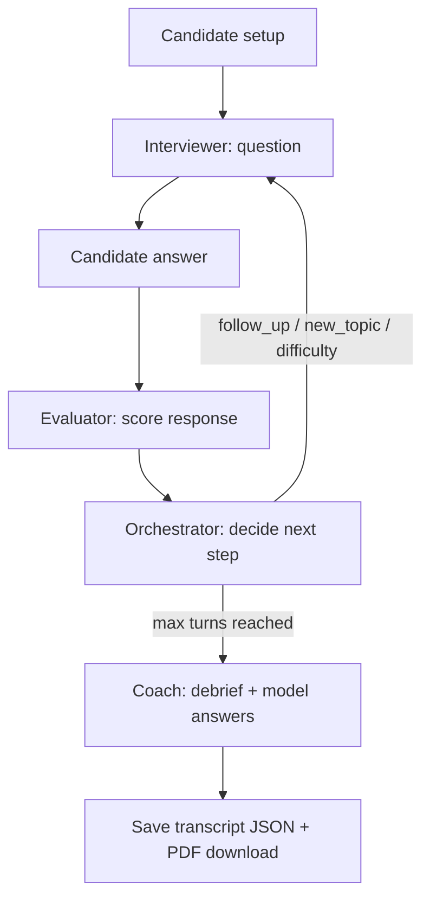

# AI Mock Interview Coach

A production-style prototype of a **multi-agent** mock interview system. Three specialized LLM agents (Interviewer, Evaluator, Coach) collaborate through an **orchestrator** that runs adaptive 5–7 question interviews and delivers structured coaching feedback.

Built with **Python**, **Groq**, and a **Streamlit** web UI.

## Project overview

This is not a single chatbot. Each agent has distinct prompts, responsibilities, and output formats:

| Agent | Responsibility | Output |
|-------|----------------|--------|
| **Interviewer** | Conducts the interview; adaptive questions | JSON question payload |
| **Evaluator** | Scores each answer on 8 dimensions | JSON scores + follow-up signals |
| **Coach** | Post-interview debrief + exemplar answers | Markdown + per-turn model answers |
| **Orchestrator** | Coordinates flow, difficulty, probing | Rule-based decisions |

## Architecture



### Orchestration flow

1. Candidate provides role, background, and focus (behavioral / technical / case / mixed).
2. Interviewer asks opening question (JSON).
3. Candidate responds in the chat UI.
4. Evaluator returns structured scores and follow-up signals (not shown during the interview).
5. Orchestrator applies rules:
   - **Weak answer** (overall &lt; 6.5 + follow-up flag): probe deeper.
   - **Strong** (≥ 7.5): increase difficulty, new topic.
   - **Struggling** (≤ 4.5): decrease difficulty, redirect.
   - **Max turns** (5–7): end session → Coach debrief.
6. Loop until the question limit; transcript saved under `mock_interview_coach/transcripts/`.

### Repository layout

```
mock-interview-ai/
├── mock_interview_coach/
│   ├── agents/
│   │   ├── interviewer.py
│   │   ├── evaluator.py
│   │   ├── coach.py
│   │   └── orchestrator.py
│   ├── prompts/
│   │   ├── interviewer_prompt.txt
│   │   ├── evaluator_prompt.txt
│   │   ├── coach_prompt.txt
│   │   └── model_answer_prompt.txt
│   ├── memory/
│   │   └── conversation_state.py
│   ├── utils/
│   │   ├── llm.py
│   │   ├── parser.py
│   │   └── pdf_report.py
│   ├── transcripts/
│   └── app.py              # Streamlit UI
├── requirements.txt
├── .env.example
└── README.md
```

## Setup

### Prerequisites

- Python 3.10+
- [Groq API key](https://console.groq.com/keys)

### Install

```bash
cd mock-interview-ai
python -m venv .venv
source .venv/bin/activate   # Windows: .venv\Scripts\activate
pip install -r requirements.txt
cp .env.example .env
```

Edit `.env` and set `GROQ_API_KEY`.

### Environment variables

| Variable | Required | Description |
|----------|----------|-------------|
| `GROQ_API_KEY` | Yes | Groq API key |
| `GROQ_MODEL` | Yes | Default `llama-3.3-70b-versatile` |
| `GROQ_FALLBACK_MODEL` | No | Auto-retry model on rate limit (429) |
| `GROQ_TIMEOUT_SEC` | No | Request timeout in seconds (default `45`) |

**Rate limits:** The free tier has daily token caps per model. If you hit limits on a large model, set `GROQ_MODEL=llama-3.1-8b-instant` or wait for the quota to reset.

## How to run

```bash
streamlit run mock_interview_coach/app.py
```

Open the URL shown in the terminal (usually http://localhost:8501).

### Using the app

1. Enter target role and optional background/resume snippet.
2. Choose interview focus (mixed, behavioral, technical, or case).
3. Select number of questions (5, 6, or 7) from the dropdown.
4. Answer each question in the chat.
5. When the interview ends:
   - **Session review** — coach debrief (strengths, gaps, practice plan, readiness).
   - **Questions & model answers** — your answers vs strong exemplar responses.
   - **Download PDF report** — formatted session summary.
6. A JSON transcript is saved under `mock_interview_coach/transcripts/`.

## Example transcript

See `mock_interview_coach/transcripts/example_session_swe_intern.json` for a sample session shape.

**Turn 1:** Shallow answer → Evaluator recommends follow-up → Orchestrator probes deeper.

**Turn 2:** Stronger technical answer → Orchestrator increases difficulty and changes topic.

After all turns, the Coach agent synthesizes feedback and model answers for each question.

## Design decisions

- **True multi-agent separation**: Prompts live in `prompts/`; agents do not share system prompts.
- **Orchestrator is code, not LLM**: Deterministic rules over evaluator JSON keep behavior debuggable.
- **JSON with fallbacks**: Strict JSON on first attempt; plain-text + repair on failure; retries and model fallback on Groq 429.
- **Per-turn model answers**: One LLM call per question for reliable exemplar generation.
- **State object**: `ConversationState` tracks topics, weaknesses, difficulty, and scores.
- **Lightweight stack**: No LangChain — direct `groq` client and `fpdf2` for PDF export.

## Tradeoffs and limitations

- Orchestrator rules are heuristic, not learned.
- Quality and quotas depend on Groq model choice.
- No RAG question bank or web grounding in this baseline.
- Each answer triggers Evaluator + Interviewer API calls (latency scales with question count).
- Final debrief runs Coach feedback plus one model-answer call per question.

## Future improvements

- RAG over curated question banks per role template
- Streamlit charts for dimension trends across turns
- Session analytics dashboard
- Multimodal input (audio/video)

## License

Prototype for internship / portfolio demonstration.
